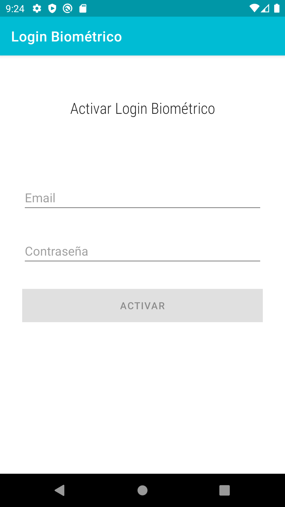

# Autenticación Biométrica

Hola, soy José Humanes Humanes, ingeniero de software independiente. Me dedico al desarrollo de aplicaciones nativas Android, con una arquitectura robusta y escalable que alarga su vida útil y facilita su mantenimiento.

## Descripción

Este es un ejemplo de autenticación biométrica. Se utilizará un usuario y contraseña para obtener un token válido de un servidor, aunque esta parte está simulada para el ejemplko a través de la clase User.

Mediante la huella dactilar se dará acceso a encriptar y desencriptar el token dentro de un archivo de SharedPreferences encriptado.

Posteriormente, cada vez que el usuario accede a la aplicación deberá autenticarse de forma biométrica para poder desencriptar el token obtenido del servidor y acceder a la zona privada de la aplicación.


## Configuración de la huella digital en el emulador

1. Activar el bloqueo de pantalla.
    
    Settings - Security - Screen lock - PIN (1234)

2. Configurar una huella digital.

    Settings - Security - Fingerprint
    
    Simular que tocamos el sensor de huella desde la línea de comandos (esto se puede pedir varias veces):
    
    ```bash
    cd ~/AppData/Local/Android/Sdk/platform-tools
    ./adb -e emu finger touch 11aa11 (ejecutar esto las veces que pida la huella)
   ```

    
## Poner la huella en el emulador cuando se pida

Se ejecuta el mismo comando de huella con el mismo id con el que se configuró la huella.

```bash
cd ~/AppData/Local/Android/Sdk/platform-tools
./adb -e emu finger touch 11aa11
```

## Ejemplo

En el archivo data/data/paquete-de-la-app/shared-prefs/biometric_prefs.xml del emulador se puede encontrar el token encriptado.




